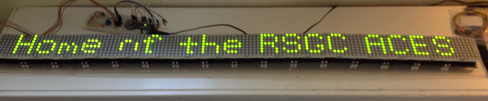

# RSGC ACES: Message Board

## Fall 2015: Beginnings
As a Grade 10 student, O. Logush agreed to develop the code for a message board to be located over the door of the DES. I would develop the hardware.
Here's what we came up with in the Spring of 2016: [Message Board](http://darcy.rsgc.on.ca/ACES/PCBs/index.html#ScrollingMessageBoard).

## Spring 2020: Native SPI Version
With time to spare over the COVID-19 March Break of 2020, I had time to revisit the firmware of the board with a view to developing a fast, library-free, native SPI version. 

### Transitions  
A MAX7219 register level fade-to-black, coupled with software-based rise and fall shifts, provides a few transition options, randomly selected.

### Hardware
Additional modifications included
1. Replacing the UNO/Chronodot/Shield with a Nano/Chronodot on a breadbord.
2. Temperature sensing with a TC74 (I2C), and,
3. Audio Frequency monitoring with the RSGC MSGEQ7 Audio Dock [MSGEQ7 BoB](http://darcy.rsgc.on.ca/ACES/PCBs/index.html#AudioDock) with MAX9814 AGC Mic.

The power supply remains a 5V2A AC/DC adapter.

